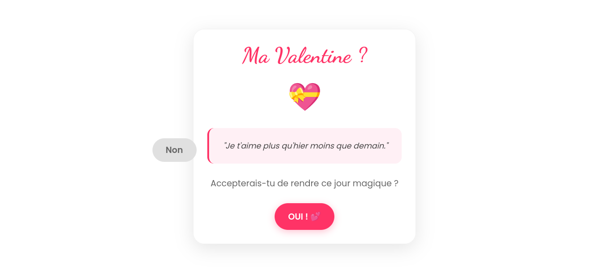

# 🌹 Ma Valentine - Interactive Web Experience 💝

Un site web interactif, "simpliste" et élégant pour poser LA question. Ce projet mélange animations CSS, logique JavaScript malicieuse et une configuration Docker durcie.



## ✨ Fonctionnalités

- **Design Épuré** : Un fond blanc minimaliste avec une pluie d'emojis animés (`🌹`, `💖`, `✨`) qui flottent dynamiquement.
- **Le Bouton "Non" Capricieux** : 
  - Il fuit le curseur (ou le doigt) de manière aléatoire sur tout l'écran.
  - **Fatigue mécanique** : Après exactement 1 minute, le bouton se fatigue (🥵), se fige à sa position actuelle et devient cliquable.
  - **Verdict** : Cliquer sur "Non" déclenche une modale expliquant que ce n'est pas la bonne option.
- **Célébration Massive** : En cliquant sur "OUI", une explosion de confettis et de cœurs via Canvas JS s'empare de l'écran.
- **Sécurité "Anti-Triche"** : 
  - Interdiction du clic droit.
  - Blocage des raccourcis d'inspection (F12, Ctrl+Shift+I, etc.).
  - Une tentative de triche déclenche une modale spécifique avec un bouton de retour.
- **Ultra-Responsive** : Adapté pour tous les écrans (Mobile, Tablette, Desktop) en mode *Single Page* sans scroll.

## 🛠️ Stack Technique

- **Frontend** : HTML5, CSS3 (Animations & Flexbox), Vanilla JavaScript.
- **Serveur** : Nginx (Alpine Linux).
- **Containerisation** : Docker avec durcissement de sécurité (User non-root).

## 🐳 Déploiement Docker (Sécurisé)

Le projet est "dockerisé" pour être déployé en quelques secondes avec une sécurité renforcée.

### Prérequis
- Docker installé sur votre machine.

### Construction de l'image
```bash
docker build -t valentine-project .

```

### Lancement du conteneur

Le conteneur est configuré pour écouter sur le port interne **8080** (utilisateur non-privilégié) et peut être mappé sur le port **80** de votre machine :

```bash
docker run -d -p 80:8080 --name valentine_app valentine-project

```

Accédez ensuite à : `http://localhost`

## 🔒 Sécurité Docker appliquée

* **Utilisateur Non-Root** : Nginx tourne sous l'utilisateur `nginx` (UID 101) pour limiter la surface d'attaque.
* **Système de fichiers Read-Only** : Le code source est injecté avec des permissions `555` (lecture seule).
* **Hardening des ports** : Utilisation du port 8080 pour éviter l'usage des ports privilégiés.

## 📜 Licence

Ce projet est libre d'utilisation pour répandre l'amour (et un peu de frustration avec le bouton Non).


